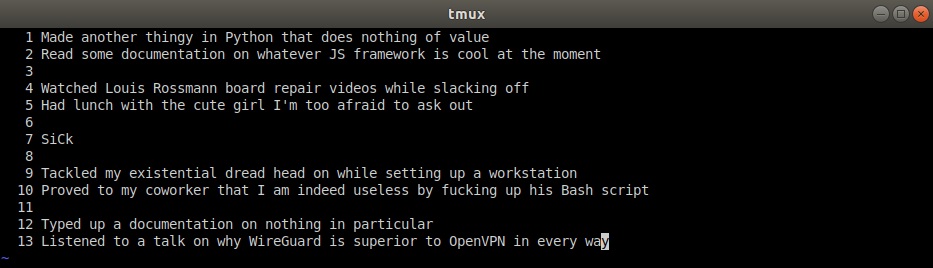
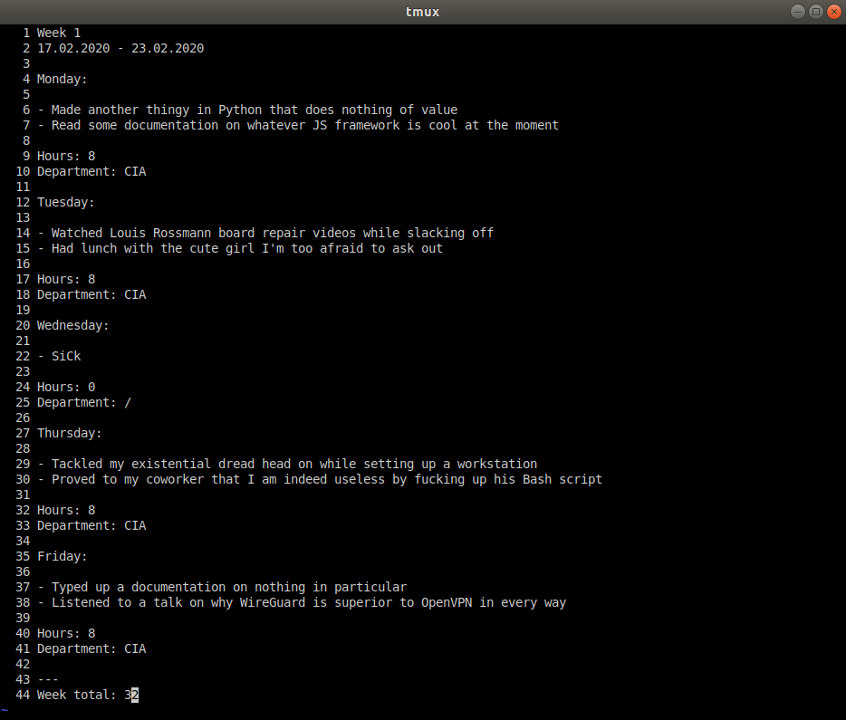

## wt.py - work tracker

I created this little tool during my second year as an IT apprentice. It takes in a file containing notes on what you did on each day and assembles a somewhat nicely formatted file, ready to be uploaded to the IHK servers.

Now, while I did strip the script of all the juicy personal info and modify it a little to make it useful to people who are not German apprentices, this is mainly intended to be for display purposes only. I just needed a project to put on here to make this account at least somewhat worthwile.

### Usage

Clone this to wherever you want it on your filesystem. It might make sense to add an alias to your .bash_aliases and statically pass the script a notes file you change every week. At least, that's how I do it.

`alias wt="<wt_dir>/wt.py <notes_file>"`

Alternatively, you can run the script directly and pass it a file to be parsed every time you do.

It's also sensible to adjust the NAME variable in the script.

The script expects the input file to contain a list of tasks for each day, separated by an empty line. To illustrate:

The file in total contains five lists, and four spaces.

Next, execute the script on this file.

`./wt.py test`

This is what the finished product will look like:

